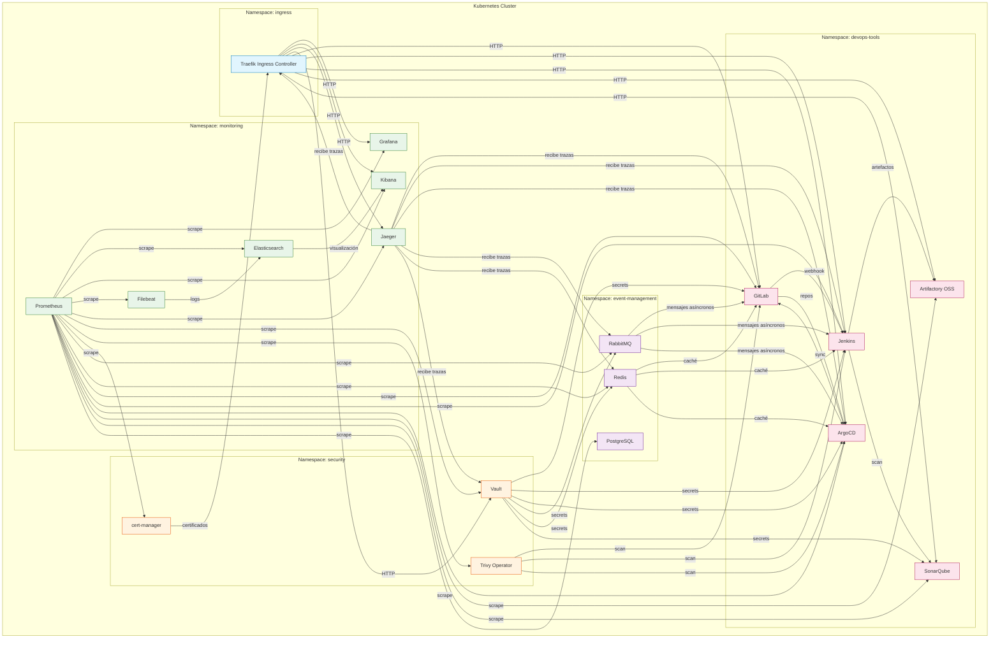

# 🚀 Plataforma DevOps sobre Kubernetes

**Infraestructura completa para el desarrollo, despliegue y monitoreo de microservicios.**  
Centraliza código, pipelines, artefactos, observabilidad y seguridad en un solo clúster local.

## 📖 Contenido

- [Introducción](#-introducción)
- [Arquitectura](#-arquitectura)
- [Componentes clave](#-componentes-clave)
- [Capturas de pantalla](#-capturas-de-pantalla)
- [Documentación técnica](#-documentación-técnica)
- [Roadmap](#-roadmap)
- [Licencia](#-licencia)

---

## 🧠 Introducción

**¿Cuál es el proposito de esta plataforma?**  
Unifica en un solo clúster Kubernetes todo el ecosistema necesario para el ciclo de vida del software. Desde el primer git push hasta la traza final en Jaeger, pasando por pipelines CI/CD, análisis de calidad, artefactos, despliegue GitOps, métricas, logs y secretos – todo integrado y automatizado

**¿Qué valor aporta?**  
- 🚀 **Aceleración del despliegue** con pipelines automatizados y GitOps.
- 🔍 **Visibilidad completa** gracias a métricas, logs y trazas centralizadas.
- 🔐 **Seguridad integrada** mediante escaneo de vulnerabilidades y gestión de secretos.

**¿Para quién está pensada?**  
Para ingenieros que quieren demostrar su capacidad para diseñar, desplegar y documentar una plataforma DevOps completa sobre Kubernetes. Para equipos que buscan una base sólida y reproducible sobre la cual construir su ecosistema de microservicios. Para mentes curiosas que disfrutan ver cómo encajan las piezas: desde un commit en GitLab hasta una traza en Jaeger, pasando por métricas en Grafana y logs en Kibana. En resumen: una vitrina técnica que también resuelve problemas reales.

---

## 🏗️ Arquitectura

El siguiente diagrama muestra la relación entre los componentes principales:

## ⚙️ Componentes clave

| Componente                            | Función                                                                                                            |
|---------------------------------------|--------------------------------------------------------------------------------------------------------------------|
| Traefik                               | Ingress Controller con balanceo de carga y soporte TLS.                                                            |
| GitLab                                | Repositorio de código, gestión de proyectos y registro de contenedores.                                            |
| Jenkins                               | servidor de automatización de código abierto, diseñado para implementar la integración y entrega continuas (CI/CD) |
| ArgoCD                                | Despliegue GitOps (sincronización automática desde Git).                                                           |
| JFrog Artifactory OSS                 | Repositorio universal de artefactos (Docker, Helm, Maven, npm).                                                    |
| SonarQube                             | Análisis estático de código (calidad y seguridad).                                                                 |
| Prometheus + Grafana                  | Recolección de métricas y dashboards de monitorización.                                                            |
| ELK (Elasticsearch, Kibana, Filebeat) | Logging centralizado y visualización.                                                                              |
| Jaeger                                | Trazabilidad distribuida (OTLP).                                                                                   |
| Vault                                 | Gestión de secrets y control de acceso.                                                                            |
| Trivy Operator                        | Escaneo de vulnerabilidades en imágenes y configuraciones.                                                         |
| Cert‑Manager                          | Automatización de certificados TLS.                                                                                |
| RabbitMQ                              | Mensajería asíncrona entre microservicios.                                                                         |
| Redis                                 | Caché distribuida (standalone).                                                                                    |
| PostgreSQL                            | Base de datos relacional compartida                                                                                |

## 📸 Imagenes de los componentes utilizados

Interfaces de los principales servicios desplegados en el clúster.

| Servicio                  | Captura                                                                                            |
|---------------------------|----------------------------------------------------------------------------------------------------|
| **ArgoCD**                | [Login](screenshots/argocd-login.png) – [Applications](screenshots/argocd-dashboard.png)           |
| **JFrog Artifactory OSS** | [Login](screenshots/artifactory-login.png) – [Packages](screenshots/artifactory-dashboard.png)     |
| **GitLab**                | [Login](screenshots/gitlab-login.png) – [Home](screenshots/gitlab-dashboard.png)                   |
| **Jenkins**               | [Login](screenshots/jenkins-login.png) – [Dashboard](screenshots/jenkins-dashboard.png)            |
| **pgAdmin**               | [Login](screenshots/pgadmin-login.png) – [Dashboard](screenshots/pgadmin-dashboard.png)            |
| **SonarQube**             | [Login](screenshots/sonarqube-login.png) – [Setup](screenshots/sonarqube-dashboard.png)            |
| **RabbitMQ Management**   | [Login](screenshots/rabbitmq-login.png) – [Overview](screenshots/rabbitmq-dashboard.png)           |
| **Redis Insight**         | [Terms](screenshots/redis-insight-init.png) – [Databases](screenshots/redis-insight-dashboard.png) |
| **Traefik Dashboard**     | [Dashboard](screenshots/traefik-dashboard.png)                                                     |
| **Alertmanager**          | [Alerts](screenshots/alertmanager-dashboard.png)                                                   |
| **Grafana**               | [Login](screenshots/grafana-login.png) – [Home](screenshots/grafana-dashboard.png)                 |
| **Jaeger**                | [Search](screenshots/jaeger-dashboard.png)                                                         |
| **Prometheus**            | [Query](screenshots/prometheus-dashboard.png)                                                      |
| **Kibana**                | [Login](screenshots/kibana-login.png) – [Home](screenshots/kibana-dashboard.png)                   |
| **Vault**                 | [Login](screenshots/vault-login.png) – [Dashboard](screenshots/vault-dashboard.png)                |

💡 **Tip:** Las capturas son reales del entorno de desarrollo; la apariencia puede variar según la configuración.

## 📚 Documentación técnica

Para obtener instrucciones detalladas de instalación, configuración personalizada, operación y troubleshooting, consulta:

🔗 **[Documentación completa de la infraestructura →](k8s/README.md)**

Allí encontrarás:
- Orden de instalación por fases.
- Archivos values.yaml personalizados.
- Guía de operaciones y comandos útiles.
- Solución de problemas específicos.
- Desinstalación completa.

## 📄 Licencia

Este proyecto está licenciado bajo los términos de la Licencia MIT. Consulta el archivo [LICENSE.md](LICENSE.md) para más detalles.

