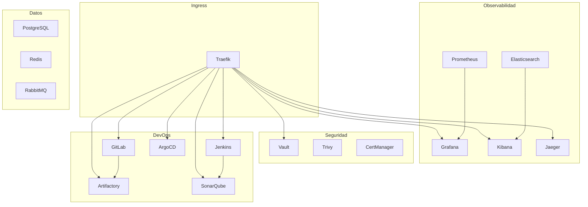

[](https://kubernetes.io/)
[](https://minikube.sigs.k8s.io/)
[](https://helm.sh/)
[](https://choosealicense.com/licenses/mit/)

# Infraestructura Kubernetes para Arquitectura de Microservicios

Documentación completa del clúster Kubernetes desplegado en entorno local (WSL2/Ubuntu con Minikube) que alberga una plataforma DevOps completa: servicios de datos, observabilidad, seguridad, CI/CD e ingreso.

## 📖 Tabla de Contenidos

- [1. Introducción](#1-introducción)    
- [2. Requisitos Previos](#2-requisitos-previos)    
- [3. Estructura de Directorios](#3-estructura-de-directorios)
- [4. Orden de Instalación](#4-orden-de-instalación)
    - 4.1 [Fase 1: Infraestructura base](#41-fase-1-infraestructura-base)
    - 4.2 [Fase 2: Observabilidad base](#42-fase-2-observabilidad-base)
    - 4.3 [Fase 3: Seguridad](#43-fase-3-seguridad)
    - 4.4 [Fase 4: Servicios de datos](#44-fase-4-servicios-de-datos)
    - 4.5 [Fase 5: Ingress (Traefik)](#45-fase-5-ingress-traefik)
    - 4.6 [Fase 6: DevOps (CI/CD y repositorios)](#46-fase-6-devops-cicd-y-repositorios)
- [5. Componentes Detallados](#5-componentes-detallados) 
- [6. Acceso a Interfaces](#6-acceso-a-interfaces)
    - 6.1 [Configuración de dominios locales](#61-configuración-de-dominios-locales)
    - 6.2 [Tabla de servicios expuestos](#62-tabla-de-servicios-expuestos)
    - 6.3 [Credenciales por defecto](#63-credenciales-por-defecto)
- [7. Guía de Operaciones](#7-guía-de-operaciones)
    - 7.1 [Comandos básicos de kubectl](#71-comandos-básicos-de-kubectl)
    - 7.2 [Monitoreo de recursos](#72-monitoreo-de-recursos)
    - 7.3 [Gestión del túnel de Minikube](#73-gestión-del-túnel-de-minikube)
    - 7.4 [Problemas comunes](#74-problemas-comunes)
- [8. Troubleshooting Específico](#8-troubleshooting-específico)   
- [9. Desinstalación](#9-desinstalación)
    - 9.1 [Eliminación ordenada de componentes](#91-eliminación-ordenada-de-componentes)
    - 9.2 [Limpieza de PVCs y namespaces](#92-limpieza-de-pvcs-y-namespaces)
- [10. Referencias](#10-referencias)
- [11. Buenas Prácticas y Mejoras](#11-buenas-prácticas-y-mejoras)
    - 11.1 [Problemas detectados](#111-problemas-detectados)    
    - 11.2 [Recomendaciones para producción](#112-recomendaciones-para-producción)

---

## 1. Introducción

Este proyecto despliega una plataforma completa que soporta el desarrollo y despliegue de microservicios. No se refiere a los microservicios de negocio en sí, sino a la infraestructura de soporte (plataforma) que permite construirlos, desplegarlos y monitorearlos sobre Kubernetes. La arquitectura está dividida en capas lógicas:

- **Ingress**: Traefik como punto único de entrada.
- **Observabilidad**: Prometheus, Grafana, Alertmanager, Elasticsearch, Kibana, Filebeat, Jaeger.
- **Seguridad**: Vault, Trivy Operator, Cert‑Manager.
- **Servicio de manejo de eventos**: Redis (standalone), RabbitMQ
- **DevOps**: GitLab, Jenkins, JFrog Artifactory OSS, ArgoCD, SonarQube.

Todos los componentes están etiquetados con `part-of: microservices-platform` para facilitar su identificación.



## 2. Requisitos Previos

| Recurso | Especificación                                                                                                            |
|---------|---------------------------------------------------------------------------------------------------------------------------|
| Sistema operativo | WSL2/Ubuntu 22.04+                                                                                                        |
| Kubernetes | Minikube v1.38.1+ (cluster local)                                                                                         |
| Recursos recomendados | 8‑12 CPUs, 20-28 GB RAM, 100 GB disco                                                                                     |
| Herramientas | kubectl v1.34.1+, helm v3.18.3+, docker (para Minikube driver)                                                            |
| Addons de Minikube | dashboard, metrics-server, registry, storage-provisioner, default-storageclass, ingress (opcional, porque usamos Traefik) |

### 🔧 Configuración inicial de Minikube

```bash
minikube start --cpus=12 --memory=28672 --disk-size=100g --driver=docker
minikube start --cpus=8 --memory=20480 --disk-size=100g --driver=docker
minikube addons enable metrics-server
minikube addons enable storage-provisioner
```

**Importante:** Asegúrate de que el driver docker esté correctamente instalado y que tu usuario tenga permisos para ejecutar docker sin sudo.

## 3. Estructura de Directorios

```
k8s/
├── config/                          # Configuraciones base
│   ├── namespace.yaml               # Creación de namespaces
│   ├── network-policies.yaml        # Políticas de red
│   └── storage-class.yaml           # Clases de almacenamiento
├── cert-manager/                    # Manifiestos/values de cert-manager
├── ingress/
│   └── traefik/                     # Values de Traefik e IngressRoutes
├── monitoring/
│   ├── elk/                         # Elasticsearch, Kibana, Filebeat
│   ├── prometheus-stack/            # kube-prometheus-stack
│   └── jaeger/                      # Jaeger v2 con Elasticsearch
├── security/
│   ├── trivy/                       # Trivy Operator
│   └── vault/                       # Vault
├── event-management/                # Servicios de datos
│   ├── redis/                       # Redis standalone (ot-helm/redis)
│   ├── rabbitmq/                    # RabbitMQ Cluster Operator
│   └── ddbb/                        # PostgreSQL
├── devops-tools/                    # Herramientas para DevOps
│   ├── gitlab/                      # GitLab CE (minimalista)
│   ├── jenkins/                     # Jenkins con init corregido
│   ├── artifactory/                 # JFrog Artifactory OSS
│   ├── argocd/                      # ArgoCD
│   └── sonarqube/                   # SonarQube Community Build
└── dashboard/                       # Kubernetes Dashboard (addon de Minikube)
```

**Nota:** Cada subdirectorio contiene sus propios archivos values.yaml personalizados.

## 4. Orden de Instalación

El orden respeta las dependencias entre componentes (base de datos, Redis, Ingress, etc.). Se recomienda seguir las fases secuencialmente se desea instalar todos los componentes.

### 4.1 Fase 1: Infraestructura base

- **Namespaces, StorageClass y Network Policies** – Consultar `config/README.md`.
- **Cert‑Manager**  Consultar `cert-manager/README.md`.

### 4.2 Fase 2: Observabilidad base

- **Prometheus Stack** – Consultar `monitoring/prometheus-stack/README.md`.
- **ELK (Elasticsearch, Kibana, Filebeat)** – Consultar `monitoring/elk/README.md`.
- **Jaeger** – Consultar `monitoring/jaeger/README.md`.

### 4.3 Fase 3: Seguridad

- **Vault** – Consultar `security/vault/README.md`.
- **Trivy Operator** – Consultar `security/trivy/README.md`.

### 4.4 Fase 4: Servicios de datos

> **Importante:** El PostgreSQL externo debe estar operativo antes de instalar GitLab, Artifactory y SonarQube.

- **PostgreSQL externo** – Consultar `devops-tools/ddbb/README.md`.
- **Redis (standalone)** – Consultar `event-management/redis/README.md`.
- **RabbitMQ (Cluster Operator)** – Consultar `event-management/rabbitmq/README.md`.

### 4.5 Fase 5: Ingress (Traefik)

- **Traefik** – Consultar `ingress/traefik/README.md`.  
  Después de desplegar Traefik, aplica los `IngressRoute` de cada componente (ver sus respectivos README).

### 4.6 Fase 6: DevOps (CI/CD y repositorios)

- **GitLab** – Consultar `devops-tools/gitlab/README.md`.
- **Jenkins** – Consultar `devops-tools/jenkins/README.md`.
- **JFrog Artifactory OSS** – Consultar `devops-tools/artifactory/README.md`.
- **ArgoCD** – Consultar `devops-tools/argocd/README.md`.
- **SonarQube** – Consultar `devops-tools/sonarqube/README.md`.

**Nota:** Cada componente tiene su propio archivo values.yaml personalizado (recursos reducidos, etiquetas, base de datos externa, etc.). Los detalles se explican en la sección 5.

## 5. Componentes Detallados

| Componente            | Namespace        | Método                                          | Configuración clave                                                                                           |
|-----------------------|------------------|-------------------------------------------------|---------------------------------------------------------------------------------------------------------------|
| Traefik               | ingress          | Helm chart traefik-39.0.7                       | Dashboard con corrección Header para gRPC, servicio LoadBalancer                                              | 
| Prometheus            | monitoring       | Helm chart kube-prometheus-stack-82.15.1        | ServiceMonitor para todos los componentes, retención 10d, PVC 10Gi                                            | 
| Grafana               | monitoring       | Helm chart kube-prometheus-stack-82.15.1        | Contraseña admin configurable, PVC 5Gi, permisos corregidos (fsGroup)                                         | 
| Alert Manager         | monitoring       | Helm chart kube-prometheus-stack-82.15.1        |                                                                                                               | 
| Elasticsearch         | monitoring       | Helm chart elasticsearch-8.5.1                  | 1 réplica, recursos 100m/1.5Gi, seguridad desactivada, PVC 10Gi                                               | 
| Kibana                | monitoring       | Helm chart kibana-8.5.1                         | createKibanaTokenJob: false, HTTP, sin TLS                                                                    | 
| Filebeat              | monitoring       | Helm chart filebeat-8.5.1                       | DaemonSet, privilegiado, envía logs a Elasticsearch                                                           | 
| Jaeger                | monitoring       | Helm chart jaeger-4.6.0                         | Almacenamiento en Elasticsearch, OTLP receiver, ServiceMonitor                                                | 
| Vault                 | security         | Helm chart vault-0.32.0                         | UI habilitada, persistencia 10Gi, modo dev (sin TLS)                                                          | 
| Trivy Operator        | security         | Helm chart trivy-operator-0.32.1                | Escaneo de vulnerabilidades, excluye kube-system, severidad HIGH/CRITICAL                                     | 
| Redis                 | event-management | Helm chart redis-0.16.9                         | Standalone, sin auth, PVC 3Gi, recursos 100m/256Mi                                                            | 
| RabbitMQ              | event-management | Cluster Operator y Cluster                      | 1 réplica (desarrollo), imagen management, PVC 10Gi                                                           | 
| PostgreSQL            | devops-tools     | Helm chart postgresql-18.5.15 y pgadmin4-1.62.0 | PVC 10Gi, bases de datos para (gitlabhq_production, sonarqube, artifactory)                                   | 
| GitLab                | devops-tools     | Helm chart gitlab-9.10.1                        | CE, Redis externo, PostgreSQL externo, recursos reducidos (100m CPU)                                          | 
| Jenkins               | devops-tools     | Helm chart jenkins-5.9.12                       | StatefulSet con init container corregido (cp -n), PVC 10Gi, plugins preinstalados (gitlab, docker-workflow)   | 
| JFrog Artifactory OSS | devops-tools     | Helm chart artifactory-oss-107.133.17           | PostgreSQL externo, credenciales admin/password, recursos 500m/2Gi                                            | 
| ArgoCD                | devops-tools     | Helm chart argo-cd-9.4.17                       | Redis externo, sin TLS, dos reglas IngressRoute (web y gRPC con Header), recursos reducidos                   | 
| SonarQube             | devops-tools     | Helm chart sonarqube-2026.2.1                   | Community Build, PostgreSQL externo, monitoringPasscode configurado, recursos 500m/2Gi                        | 
| Cert‑Manager          | cert-manager     | Helm chart  cert-manager-v1.20.1                | CRDs instalados, emisor Let's Encrypt                                                                         | 

**Nota:** Todos los componentes incluyen la etiqueta part-of: microservices-platform en sus recursos (pods, servicios, etc.) mediante commonLabels o podLabels según el chart.

## 6. Acceso a Interfaces

### 6.1 Configuración de dominios locales

Para acceder a los servicios a través de Traefik, añade la IP de Minikube al archivo /etc/hosts:

```bash
echo "$(minikube ip) gitlab.desarrollo jenkins.desarrollo artifactory.desarrollo argocd.desarrollo sonarqube.desarrollo traefik.desarrollo grafana.desarrollo prometheus.desarrollo kibana.desarrollo jaeger.desarrollo vault.desarrollo" | sudo tee -a /etc/hosts
```

### 6.2 Tabla de servicios expuestos

| Servicio | URL | Método de acceso |
|----------|-----|----------------|
| GitLab | http://gitlab.desarrollo | Ingress (Traefik) |
| Jenkins | http://jenkins.desarrollo | Ingress (Traefik) |
| JFrog Artifactory | http://artifactory.desarrollo | Ingress (Traefik) |
| ArgoCD | http://argocd.desarrollo | Ingress (Traefik) |
| SonarQube | http://sonarqube.desarrollo | Ingress (Traefik) |
| Grafana | http://grafana.desarrollo | Ingress (Traefik) |
| Prometheus | http://prometheus.desarrollo | Ingress (Traefik) |
| Kibana | http://kibana.desarrollo | Ingress (Traefik) |
| Jaeger | http://jaeger.desarrollo | Ingress (Traefik) |
| Vault | http://vault.desarrollo | Ingress (Traefik) |
| Traefik Dashboard | http://traefik.desarrollo/dashboard/ | Ingress (Traefik) con BasicAuth |

### 6.3 Credenciales por defecto

| Servicio | Usuario | Contraseña / Obtención |
|----------|--------|------------------------|
| GitLab | root | kubectl get secret gitlab-gitlab-initial-root-password -n devops-tools -o jsonpath='{.data.password}' | base64 -d |
| Jenkins | admin | Si se fijó en values: admin123; si no: kubectl exec -n devops-tools jenkins-0 -- cat /var/jenkins_home/secrets/initialAdminPassword |
| JFrog Artifactory | admin | password (cambiar en primer inicio) |
| ArgoCD | admin | kubectl get secret argocd-initial-admin-secret -n devops-tools -o jsonpath='{.data.password}' | base64 -d |
| SonarQube | admin | admin (cambiar en primer inicio) |
| Grafana | admin | kubectl get secret -n monitoring prometheus-grafana -o jsonpath='{.data.admin-password}' | base64 -d |
| Prometheus | (sin autenticación) | - |
| Kibana | (sin autenticación) | - |
| Jaeger | (sin autenticación) | - |
| Vault | Root Token | kubectl exec -it vault-0 -n security -- vault operator init (ver logs) |
| Traefik Dashboard | (BasicAuth) | Definido en el Secret traefik-dashboard-secret |

**Tip:** También puedes acceder a cualquier servicio mediante port‑forward

## 7. Guía de Operaciones

### 7.1 Comandos básicos de kubectl

```bash
# Ver todos los pods en todos los namespaces
kubectl get pods -A

# Logs de un pod específico
kubectl logs -n <namespace> <pod-name> -f

# Reiniciar un StatefulSet/Deployment
kubectl rollout restart statefulset <name> -n <namespace>
kubectl rollout restart deployment <name> -n <namespace>

# Escalar un StatefulSet/Deployment
kubectl scale statefulset <name> -n <namespace> --replicas=0
kubectl scale statefulset <name> -n <namespace> --replicas=1
```

### 7.2 Monitoreo de recursos

```bash
kubectl top nodes
kubectl top pods -n <namespace>
```

### 7.3 Gestión del túnel de Minikube

```bash
# Iniciar túnel (modo interactivo)
minikube tunnel

# Si falla por permisos de puertos, usar:
sudo -E $(which minikube) tunnel --alsologtostderr

# Ejecutar en segundo plano
nohup minikube tunnel > /tmp/minikube_tunnel.log 2>&1 &
```

### 7.4 Problemas comunes

| Problema | Síntoma | Solución |
|----------|---------|----------|
| ImagePullBackOff | Pod no descarga la imagen | Verificar que el tag de la imagen existe en Docker Hub. Usar imagePullPolicy: IfNotPresent o especificar tag concreto. |
| CrashLoopBackOff | Pod se reinicia continuamente | Revisar logs del contenedor (kubectl logs --previous). Aumentar initialDelaySeconds de las probes si la aplicación tarda en arrancar. |
| Insufficient CPU | Pod en estado Pending | Reducir requests.cpu en el values.yaml o aumentar recursos de Minikube (minikube start --cpus=...). |
| Conexión a base de datos | Error de autenticación | Verificar que la base de datos y el usuario existan en PostgreSQL (crearlos manualmente con CREATE USER y CREATE DATABASE). |

Para verificar el consumo de recursos (CPU y memoria) de los pods y nodos:

```bash
# Ver consumo de recursos de los nodos
kubectl top nodes

# Ver consumo de CPU de todos los pods ordenados
kubectl top pods --all-namespaces --sort-by=cpu

# Ver consumo de memoria de todos los pods ordenados
kubectl top pods --all-namespaces --sort-by=memory
```

> **Nota:** Estos comandos requieren que el addon `metrics-server` esté habilitado en Minikube.

## 8. Troubleshooting Específico

| Componente | Error conocido | Solución |
|------------|---------------|----------|
| Jenkins | Init container pregunta cp: overwrite ... | Editar el ConfigMap jenkins y reemplazar yes n | cp -i por cp -n. Luego kubectl rollout restart statefulset jenkins. |
| GitLab | CustomResourceDefinition "challenges.acme.cert-manager.io" ... invalid ownership metadata | Instalar con --skip-crds y, si persiste, eliminar anotaciones de Helm de los CRDs de cert‑manager: kubectl annotate crd ... meta.helm.sh/release-name- |
| Redis | Error CROSSSLOT en GitLab (cuando se usa Redis Cluster) | Migrar a Redis standalone (chart ot-helm/redis en lugar de redis-cluster). |
| Artifactory | Pod en CrashLoopBackOff con Join key missing | En values, desactivar unifiedSecretInstallation: false y crear secreto manual jfrog-secrets con las claves. |
| SonarQube | Validación falla: Please provide a monitoringPasscode | Añadir monitoringPasscode: "sonarqube-passcode-2026" (o cualquier cadena) en el values. |
| Traefik | Regla de IngressRoute con Headers da error unsupported function | Cambiar Headers por Header (singular) en la regla para gRPC. |

## 9. Desinstalación

### 9.1 Eliminación ordenada de componentes
Para eliminar todo el stack en orden inverso (respetando dependencias):

```bash
# 1. Eliminar componentes DevOps (los que dependen de PostgreSQL, Redis)
helm uninstall gitlab -n devops-tools
helm uninstall jenkins -n devops-tools
helm uninstall artifactory -n devops-tools
helm uninstall argocd -n devops-tools
helm uninstall sonarqube -n devops-tools

# 2. Eliminar Ingress
helm uninstall traefik -n ingress

# 3. Eliminar servicios de datos
helm uninstall redis -n event-management
kubectl delete -f event-management/rabbitmq/rabbitmq-cluster.yaml
kubectl delete -f https://github.com/rabbitmq/cluster-operator/releases/latest/download/cluster-operator.yml

# 4. Eliminar PostgreSQL externo (si fue desplegado manualmente)
kubectl delete -f devops-tools/ddbb/postgresql.yaml

# 5. Eliminar seguridad
helm uninstall vault -n security
helm uninstall trivy-operator -n security

# 6. Eliminar observabilidad
helm uninstall prometheus -n monitoring
helm uninstall elasticsearch -n monitoring
helm uninstall kibana -n monitoring
helm uninstall filebeat -n monitoring
helm uninstall jaeger -n monitoring

# 7. Eliminar Cert‑Manager (opcional)
helm uninstall cert-manager -n cert-manager

# 8. Eliminar namespaces (opcional, elimina todos los recursos restantes)
kubectl delete namespace event-management monitoring security devops-tools ingress cert-manager --ignore-not-found
```
### 9.2 Limpieza de PVCs y namespaces
**Advertencia:** Los PVCs no se eliminan automáticamente. Para borrar datos persistentes, añade `kubectl delete pvc -n <namespace> --all`.

## 10. Referencias

- [Kubernetes Documentation](https://kubernetes.io/docs/)
- [Minikube](https://minikube.sigs.k8s.io/docs/)
- [Helm](https://helm.sh/docs/)
- [Traefik](https://doc.traefik.io/traefik/)
- [Prometheus Operator](https://prometheus-operator.dev/)
- [Elastic Stack on Kubernetes](https://www.elastic.co/guide/en/cloud-on-k8s/current/index.html)
- [Jaeger Tracing](https://www.jaegertracing.io/docs/)
- [Vault by HashiCorp](https://www.vaultproject.io/docs/)
- [Trivy Operator](https://github.com/aquasecurity/trivy-operator)
- [GitLab Helm Chart](https://docs.gitlab.com/charts/)
- [Jenkins Helm Chart](https://www.jenkins.io/doc/book/installing/kubernetes/)
- [JFrog Artifactory Helm Chart](https://github.com/jfrog/charts)
- [ArgoCD Helm Chart](https://argo-cd.readthedocs.io/en/stable/operator-manual/installation/)
- [SonarQube Helm Chart](https://docs.sonarsource.com/sonarqube/latest/setup/install-server/kubernetes-helm/)

## 11. Buenas Prácticas y Mejoras

### 11.1 Problemas detectados en el estado actual

- **Alta demanda de CPU en el nodo:** Los requests de varios componentes (GitLab, Jenkins, Artifactory) consumen mucho CPUs. Ajustar valores si el clúster tiene menos recursos.
- **Falta de TLS:** La mayoría de servicios usan HTTP plano. En producción se debe habilitar HTTPS con cert-manager y configurar entryPoints websecure en Traefik.
- **Secrets en texto plano:** Algunos passwords (PostgreSQL, Artifactory) están en los values.yaml. En producción usar Secrets de Kubernetes o integración con Vault.
- **Single point of failure:** PostgreSQL, Redis y RabbitMQ se ejecutan en un solo pod. Para alta disponibilidad se necesitarían clústeres (ej. PostgreSQL con Patroni, Redis Sentinel, RabbitMQ cluster).
- **Riesgos de actualizaciones:** Al no fijar versiones de charts (uso de latest en algunos), una actualización inesperada podría romper compatibilidades.

### 11.2 Recomendaciones para producción

**Habilitar TLS en Traefik:**
- Configurar certResolver con Let's Encrypt en traefik-values.yaml.
- Cambiar entryPoints de web a websecure en los IngressRoute.
- Asegurar que los dominios .desarrollo sean reales y accesibles desde internet (o usar un DNS interno).

**Alta disponibilidad:**
- PostgreSQL: Usar operador como CloudNativePG o Patroni.
- Redis: Desplegar con Sentinel (ej. chart bitnami/redis con architecture=replication).
- RabbitMQ: Configurar clúster de 3 nodos.
- Artifactory: Migrar a la versión Pro con clúster.

**Gestión de secrets:**
- Almacenar contraseñas en Secrets de Kubernetes y referenciarlas en los values.yaml mediante existingSecret.
- Utilizar Vault para inyectar credenciales dinámicas a los pods.

**Backups:**
- Configurar backups periódicos de los PVCs (ej. usando Velero).
- Realizar pg_dump de PostgreSQL regularmente.

**Monitorización proactiva:**
- Configurar alertas en Prometheus para uso de CPU/memoria, errores HTTP 5xx, y fallos de sincronización de ArgoCD.
- Enviar logs críticos a Elasticsearch y crear dashboards en Kibana.

**Recursos:**
- Fijar requests y limits realistas según pruebas de carga.
- Usar HorizontalPodAutoscaler para componentes que lo soporten.
